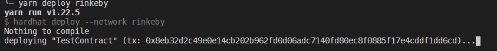
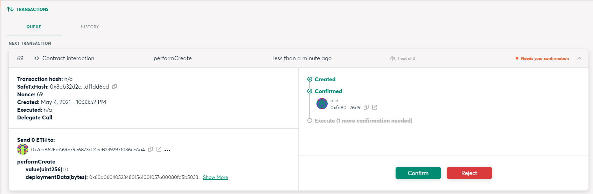

# Hardhat Safe Deployer Example

This is an example project that uses the Gnosis Safe to deploy a contract.

For the the [hardhat-safe-deployer](https://github.com/rmeissner/hardhat-safe-deployer) plugin is used.

## Install
- Run `nvm use` to set correct node version
- Run `yarn` to install dependencies

## Deployin test contract
- Setup env (See `.env.sample`)
- Run `yarn deploy rinkeby` to trigger the deployment process for Rinkeby
- Once `deploying "TestContract" [...]` is shown open the Safe in the Safe web interface (e.g. https://rinkeby.gnosis.io)

- Confirm and execute the transaction via the Safe web interface

- After deployment verify contract on Etherscan with `yarn verify rinkeby`
  - Note: make sure that Etherscan has indexed the transaction already